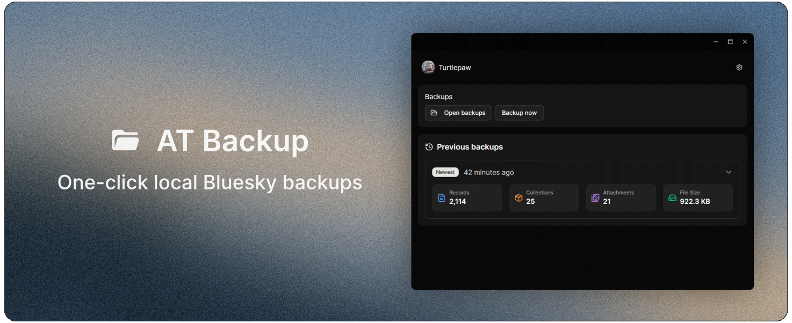

<h1>AT Backup</h1>

One-click local Bluesky/ATProto backups

## Built with

- Tauri
- React
- ATProto
- atcute (for CAR file parsing)
- shadcn UI

## Recommended IDE Setup

- [VS Code](https://code.visualstudio.com/) + [Tauri](https://marketplace.visualstudio.com/items?itemName=tauri-apps.tauri-vscode) + [rust-analyzer](https://marketplace.visualstudio.com/items?itemName=rust-lang.rust-analyzer)
